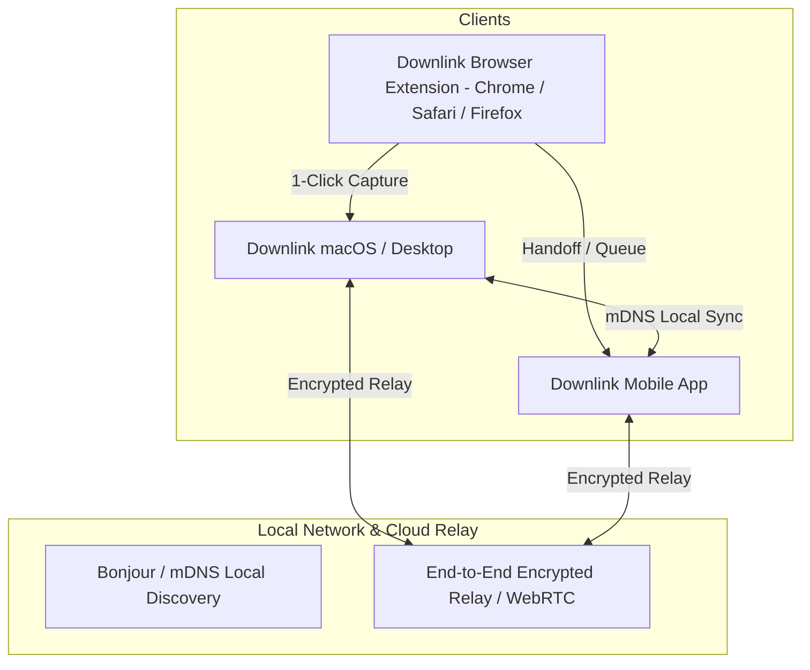

# Strategic Architecture & Blueprint: Downlink Universal Ecosystem

## Vision: The World's Most Advanced Downloader & Cross-Device Ecosystem

Downlink is positioned to transcend traditional download managers (like IDM, JDownloader, FDM, and Geonode) by combining **raw high-performance systems engineering (Rust + Tokio)**, **AI media intelligence (Whisper.cpp)**, **Apple-grade Liquid Glass design**, and an **Apple Continuity-style cross-device ecosystem (Downlink Handoff & AirDrop Sync)**.

---

## 1. Pillars of the World's Best Downloader

```
┌──────────────────────────────────────────────────────────────────────────┐
│                             DOWNLINK DESKTOP                             │
│       (Tauri v2 + Next.js 16 + Pure Rust Backend + Apple Liquid Glass)   │
├─────────────────┬──────────────────┬──────────────────┬──────────────────┤
│ MULTI-PROTOCOL  │ MEDIA & EXTRACT  │ AI INTELLIGENCE  │ CROSS-DEVICE     │
│ ACCELERATION    │ (1000+ SITES)    │ (WHISPER CORE)   │ CONTINUITY       │
├─────────────────┼──────────────────┼──────────────────┼──────────────────┤
│ • 16-32x HTTP   │ • yt-dlp binary  │ • Local Whisper  │ • mDNS / Bonjour │
│   segmented TCP │ • FFmpeg muxing  │   speech-to-text │   LAN discovery  │
│ • BitTorrent &  │ • HLS / M3U8     │ • SRT / VTT auto │ • Browser Hub    │
│   Magnet engine │ • Live stream    │   generation     │   (Chrome/Safari)│
│ • Pause/Resume  │   capture        │ • Multi-language │ • Universal Link │
│   auto-healing  │ • Cookie vault   │   translation    │   Handoff / Push │
└─────────────────┴──────────────────┴──────────────────┴──────────────────┘
```

### Pillar 1: Universal Multi-Protocol High-Throughput Engine
1. **Direct HTTP/HTTPS Chunked Acceleration**:
   - Split large files into 16 to 32 concurrent HTTP Range connections in pure Rust (`reqwest` + Tokio worker pools or embedded high-speed multi-socket engine) for maximum line saturation.
2. **Pure Rust BitTorrent & Magnet Integration (`librqbit`)**:
   - Zero external daemon dependencies.
   - Embedded DHT, peer discovery, tracker scraping, sequential downloading (preview while downloading), and granular seeding limits.
3. **Advanced Media Extraction & Stream Capture**:
   - Native `yt-dlp` toolchain runner with auto-updating nightly channels.
   - M3U8/HLS stream recording, AES-128 segment decryption, and live broadcast capture.

### Pillar 2: Embedded AI & Audio/Video Post-Processing
1. **Whisper AI Subtitle Generation**:
   - Automatic local audio extraction and speech-to-text generation via `whisper.rs` (Metal / CoreML on Apple Silicon, CUDA on Nvidia, AVX2 on x86).
2. **Audio Transcoding & Mastering**:
   - Lossless audio conversion (FLAC, ALAC, 320kbps MP3, AAC) with embedded ID3 metadata, album artwork, and chapter markers.
3. **SponsorBlock & Chapters Integration**:
   - Automatic cutting of sponsorships, intros, and filler segments directly into output containers.

### Pillar 3: Apple-Grade Liquid Glass Design System
1. **Tactile Depth & Translucency**:
   - Multi-layered glass panels blending seamlessly with macOS vibrancy and Windows Mica/Acrylic.
2. **Physical Spring Motion & Interruptibility**:
   - Fluid 1:1 direct manipulation gestures for drag-and-drop, queue reordering, and full-window overlays.
3. **Zero Monolithic Files**:
   - Modular feature components strictly adhering to the 150–300 LOC architectural standard.

---

## 2. The Centralized Cross-Device Ecosystem ("Downlink Continuity")

To create a seamless, Apple-style ecosystem across all your devices (Mac, Windows PC, Linux Workstation, iPhone, Android, and Web Browsers):



### 1. Local Network Zero-Config Discovery (Bonjour / mDNS)
- **Automatic Peer Discovery**: All Downlink desktop and mobile instances on the same Wi-Fi broadcast a local service (`_downlink._tcp.local`).
- **Instant Device Pairing**: Scan a tactile QR code from your mobile app or click "Connect" on desktop to exchange cryptographic public keys (Ed25519) — zero accounts or third-party servers required.

### 2. Browser Companion Hub & Universal Extension (Chrome, Firefox, Safari, Edge)
- **1-Click Context Menu**: Right-click any video, download link, or magnet URI → "Download with Downlink (Mac)", "Download to PC", or "Queue Remotely".
- **Intelligent Stream Sniffing**: The extension detects background video streams (M3U8/MPD/Blob URLs) and passes them with authentic headers (`User-Agent`, `Referer`, `Cookie`) directly to the desktop queue.

### 3. Downlink Handoff (Apple Continuity Pattern)
- **Send to Device / AirDrop Action**: Start a download on your laptop on the train; when you arrive at your desk, tap "Handoff to Desktop" to transfer the active download state and let your high-speed desktop gigabit network finish it.
- **Universal Clipboard & Remote Queue**: Copying a video URL or Magnet link on your phone automatically offers a subtle notification on your Mac: *"Paste in Downlink"*.

---

## 3. Phased Implementation Roadmap

### Phase 1: Core Engine Acceleration & Unified Architecture
- [x] Apple Liquid Glass UI & full-window modal system.
- [x] Polymorphic IPC Actions & Type-Safe Tauri Dispatcher.
- [x] Dual-endpoint Updater Fallback Architecture.
- [ ] BitTorrent & Magnet engine integration (`librqbit` pure Rust).
- [ ] 16x Multi-connection HTTP Range chunk accelerator.

### Phase 2: Browser Companion & Extension System
- [ ] Manifest V3 Universal Browser Extension for Chrome, Edge, and Brave.
- [ ] Native Messaging Host & loopback HTTP/WebSocket RPC server.
- [ ] Safari App Extension for macOS.

### Phase 3: Downlink Continuity & Mobile Ecosystem
- [ ] Local mDNS / Bonjour device discovery daemon in Rust.
- [ ] Peer-to-peer queue synchronization over local TLS sockets.
- [ ] Mobile companion client (iOS / Android) for remote management and link handoff.
